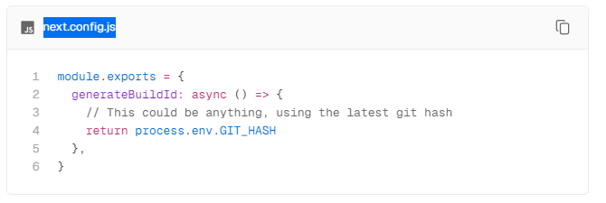

# Scaling Sitecore Headless Apps with NEXT.JS on AKS: Best Practices

## Issue identified:

`/_next/data/*` URLs throwing 404, for multiple Next.js apps running on the same domain on AKS.

## Description:

When accessing the page `https://example.com.au/search/productstest?q=rrrrr` in the network tab, you may notice that the static file /\\\_next/data/\<build-id>/404.json or any other page intermittently throws a 404 error. This behavior arises due to the presence of two pods running behind the load balancer (LB), each with distinct folder structures:\
\

1. **Pod1:** The path for this pod is `/_next/data/I8FGRt1uzTF07kBycePyz/*`, where `I8FGRt1uzTF07kBycePyz` represents a randomly generated build ID during the build process.
2. **Pod2:** The path for this pod is `_next/data/v0fSWUQI5ZTB33ntLJKtr/*`, where `v0fSWUQI5ZTB33ntLJKtr` similarly corresponds to a randomly generated build ID.

### Here’s how the process unfolds: 

1. When a request is sent to Pod1, it checks whether the requested page exists. If not, it retrieves the 404 content using the URL `_next/data/I8FGRt1uzTF07kBycePyz/en/404.json`.
2. However, in certain cases, the load balancer may direct the request to Pod2. If Pod2 lacks the folder `_next/data/I8FGRt1uzTF07kBycePyz/*`, it throws a 404 error, preventing our custom 404 error page from being displayed.

## Solution:

To address this issue, consider ensuring consistent folder structures across both pods or implementing a mechanism to handle such scenarios effectively.

### Generate a custom unique build ID:

1. Please refer to the NextJS Documentation - [https://nextjs.org/docs/app/api-reference/next-config-js/generateBuildId](https://nextjs.org/docs/app/api-reference/next-config-js/generateBuildId)
   1. "Next.js generates an ID during the next build to identify which version of your application is being served. The same build should be used and boot up multiple containers."
2. The idea behind setting a common build ID for all scaled pods is to ensure consistency and facilitate efficient quick start-up of pods. By having a consistent build ID, we can easily determine whether the built assets are already present in the shared volume. It also helps in avoiding unnecessary duplication of resources, as each pod can quickly verify the availability of the required assets based on the shared build ID.

### Code snippet:

_Copied from NEXT.JS Site_

<figure><figcaption></figcaption></figure>

##
