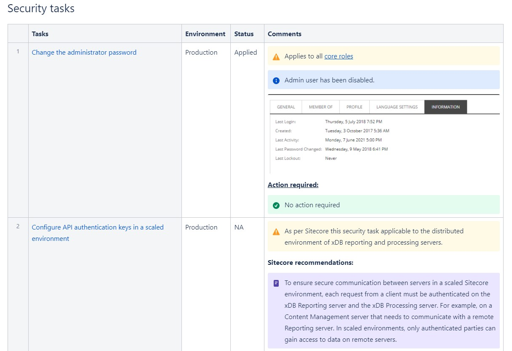

# How to secure Sitecore websites

## What is Website security

Website security is the measures or practices taken to secure a website or files from internet hackers.

## Purpose of security guidelines

In the modern websites, security became topmost priority in any organization, applying security guideline been a very important steps for every website is being built.

The purpose of website security is to protect your website from any vulnerabilities.

Website security protects from:

* DDoS attacks
* Cross-site scripting attacks
* SQL injections
* Phishing attacks
* So on...

## How to improve your Sitecore website security

Sitecore is content management system which serves lot of contents and every content should be secured. It’s very important to implement website security guideline to keep up the security standards and reputation of the clients.

Sitecore consists of different roles they must follow the security guideline which improved performance of the website as well security.

* Application roles
* Storage roles
* Indexes

Sitecore provide great documentation for security hardening and security configuration tasks.

You could run through all the security hardening task from below URL: [https://doc.sitecore.com/developers/90/platform-administration-and-architecture/en/security-tasks.html](https://doc.sitecore.com/developers/90/platform-administration-and-architecture/en/security-tasks.html)

You could also run through all the security hardening task by different roles: [https://doc.sitecore.com/developers/90/platform-administration-and-architecture/en/securing-experience-platform.html](https://doc.sitecore.com/developers/90/platform-administration-and-architecture/en/securing-experience-platform.html)

## I have used below format as secutiry check-list while applying them on server

## 🚑 Need Help?

You can always contact me on [Linkedin](https://www.linkedin.com/in/nagaraj-solanki)

